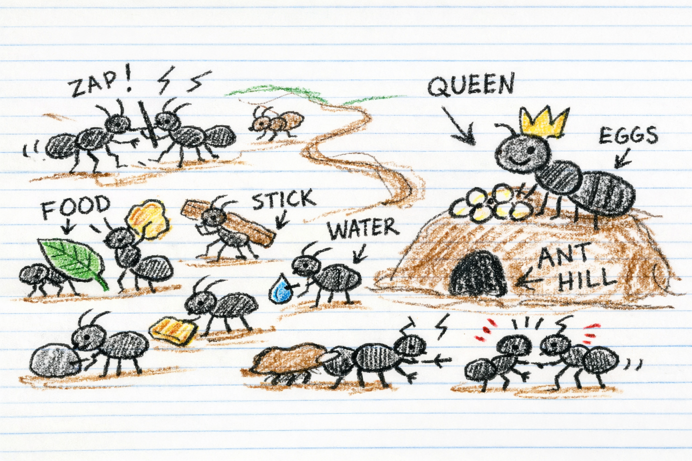

# AntCraft

P2P multiplayer real-time strategy game with ants, built on PyGame.

## Setup

Requires Python 3.12.

```bash
python -m venv .venv
source .venv/bin/activate
pip install -r requirements.txt
```

## Running the Game

### Local (single player test)

```bash
python -m src.main --local
```

Runs with a mock network peer — useful for testing movement and rendering without a second player.

### Multiplayer (P2P)

Two players connect directly over UDP. One hosts, the other joins.

**Player 1 — Host:**

```bash
python -m src.main --host 23456
```

This binds to port 23456 and waits for a peer to connect. A random seed is generated and shared with the joining player to ensure both simulations are identical.

**Player 2 — Join:**

```bash
python -m src.main --join <HOST_IP>:23456
```

Replace `<HOST_IP>` with Player 1's IP address (e.g. `192.168.1.42`). For testing on the same machine, use `127.0.0.1`.

### Networking requirements

- Both players must be able to reach each other over UDP on the chosen port.
- **Same LAN:** Works out of the box — use the host's local IP (e.g. `192.168.x.x`).
- **Over the internet:** The host needs to forward the UDP port (default `23456`) on their router to their machine, or both players can use a VPN/tunnel (e.g. Tailscale, ZeroTier) to appear on the same network.

### Options

| Flag | Description |
|------|-------------|
| `--host PORT` | Host a game on the given UDP port |
| `--join HOST:PORT` | Join a hosted game |
| `--local` | Single-player test with mock networking |
| `-v, --verbose` | Enable debug logging |

## Controls

| Input | Action |
|-------|--------|
| Left click | Select unit |
| Left click + drag | Box select multiple units |
| Right click | Context command (auto-detects: enemy=attack, corpse=harvest, hive site=found, ground=move) |
| S | Stop selected units |
| A + right-click | Attack a target |
| E + right-click | Harvest a corpse |
| M + right-click | Force move (ignore targets) |
| F + right-click | Found hive at site |
| N | Spawn ant from selected hive |
| Q | Merge selected ants into a queen |
| H | Send queen to found hive at nearest site |
| Arrow keys | Scroll camera |
| F11 | Toggle fullscreen |
| ESC | Quit |

See [docs/hotkeys.md](docs/hotkeys.md) for the full reference.

## Testing

### Automated tests

```bash
python -m pytest tests/ -v
```

The test suite covers simulation logic (movement, combat, harvesting, hive mechanics, wildlife, pathfinding, visibility). Tests run without PyGame — they exercise the deterministic simulation layer directly.

### Manual testing

```bash
python -m src.main --local
```

This starts a local game with mock networking. Things to check:

- **Economy**: jelly counter ticks up (passive income). Spawn ants with N (costs 10 jelly).
- **Movement**: select ants, right-click to move. Ants pathfind around rocks.
- **Combat**: right-click an enemy or wildlife to attack. Ants auto-attack nearby enemies.
- **Harvesting**: kill something, then right-click the corpse. Ants pick up jelly and return to hive.
- **Queens**: select 5+ ants near hive, press Q to merge. Right-click a hive site to found.
- **Wildlife**: beetles and mantis chase your units. Aphids are passive.
- **Fog of war**: areas outside unit sight are fogged.

The debug overlay (top-left) shows tick, jelly, ant count, FPS, and connection status.

## Documentation

- [docs/manual.md](docs/manual.md) — Game mechanics and rules
- [docs/hotkeys.md](docs/hotkeys.md) — Complete controls reference
- [docs/simulation.md](docs/simulation.md) — Simulation architecture (for developers)
2
